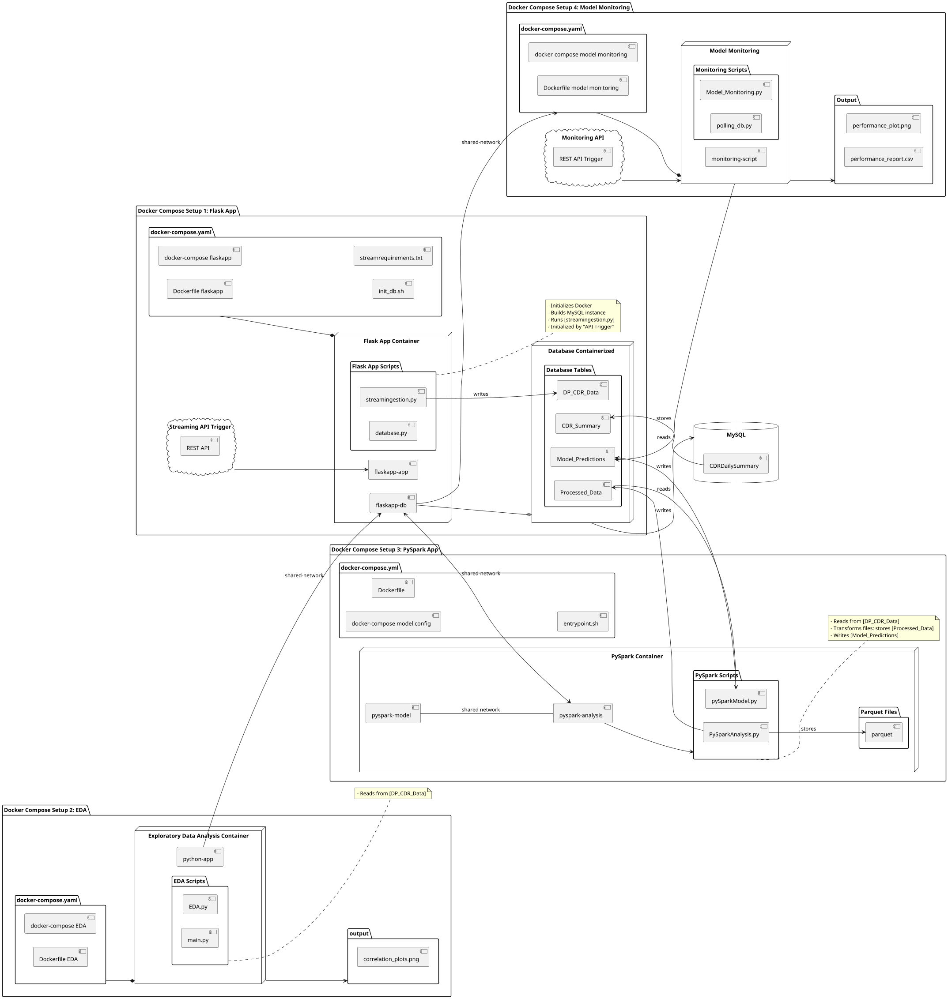
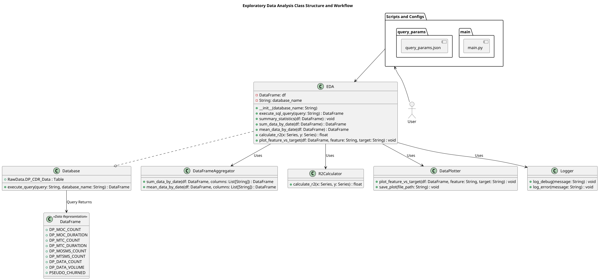
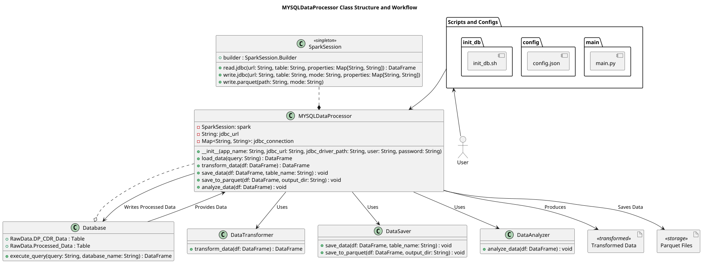
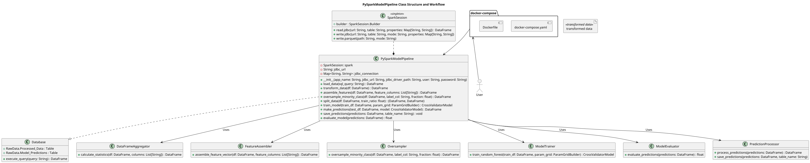
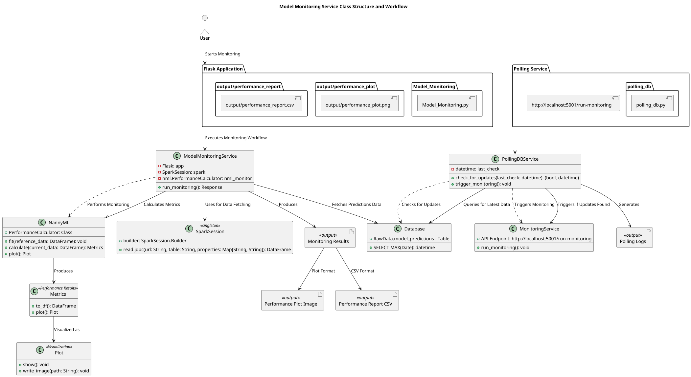

<h1 align="center">Streaming ML Modle Prediction Streaming ingestion Pipeline for Model Prediction and Monitoring</h1>
<h3 align="center">This project looks at a simulated streaming ingestion pipeline, transforms raw data to be fed into a machine learning model to make predictions on customer churn and monitorins performance of models using NannyML</h3>

<h3 align="left">Connect with me:</h3>
<p align="left">
</p>

<h3 align="left">Languages and Tools:</h3>
<p align="left"> 
  <a href="https://www.docker.com/" target="_blank" rel="noreferrer"> 
     
  </a> 
  <a href="https://git-scm.com/" target="_blank" rel="noreferrer"> 
     
  </a> 
  <a href="https://www.linux.org/" target="_blank" rel="noreferrer"> 
     
  </a> 
  <a href="https://www.mysql.com/" target="_blank" rel="noreferrer"> 
     
  </a> 
  <a href="https://pandas.pydata.org/" target="_blank" rel="noreferrer"> 
     
  </a> 
  <a href="https://www.python.org" target="_blank" rel="noreferrer"> 
     
  </a> 
  <a href="https://scikit-learn.org/" target="_blank" rel="noreferrer"> 
     
  </a> 
  <a href="https://seaborn.pydata.org/" target="_blank" rel="noreferrer"> 
     
  </a> 
  <a href="https://spark.apache.org/" target="_blank" rel="noreferrer"> 
     
  </a> 
  <a href="https://nannyml.com/" target="_blank" rel="noreferrer"> 
     
  </a> 
  <a href="https://docs.docker.com/compose/" target="_blank" rel="noreferrer"> 
     
  </a>
</p>


---
# STEP 0: Downloading Data Files from Google Cloud Storage

Head to the following _/flaskapp/DataFile_ directory and run python script _DownloadDBFile_. <br>
- Google Cloud Platform Key is added to directory via GitHub Workflows. 
- Variable path is automatically added by the script. <br>
## Steps to run _DownloadDBFile.py_
0.1 - The GitHub Workflow _main.yml_ stores the _GCP-Key.json_ in the flaskapp/DataFile directory

0.2 - Run the pip command specified in "Requirements"

0.3 - Run the _DonwloadDBFile.py_ locally

0.4 - This will place the RawData.csv required for the docker database population in the /flaskapp directory

## Requirements
```pip install google-cloud-storage```

### directory structure
```
flaskapp/ 
|--- DataFile/ 
|   └── DownloadDBFile.py 
    └── GCP-Key.json
| RawData.csv
```
---


# Step 1: Creating Shared Network and Running Flaskapp Docker Multi Container
Create a shared network using the the following command ```docker create network shared-network```.

> NOTE: It might be required to create the docker network manually, this can be done with the following two commands: ```docker network connect shared-network flaskapp-flaskapp-db-1``` and ```docker network connect shared-network flaskapp-flaskapp-app-1``` .

## 1.1 - From the _/flaskapp_ directory run the command_ ```docker compose up --build```.

This will run the docker-compose and Dockerfile which creates the instances ```flaskapp-flaskappp-db-1``` and ```flaskapp-flaskapp-app-1```, the _DataBase.py_ populates the mysql instance on the inital run in the ```flaskapp-flaskapp-db-1``` container 

The _RawData_ database now has the table _DP_CDR_Data_.

Another docker instance ```flaskapp-flaskappp-app-1``` is created. This instances host the streaming API, which generates simulated CDR records to populate the database. 
The records are randomly generated based on a sample from the _DP_CDR_Data_ database. 

## 1.2. Running Streaming Script
Once the database has been populated an streaming ingestion simulator is spun up, hosted on _flask_, this rest API is responsible for acting as customer relational records once it is triggered. The REST API has 3 paramters: 
 - _num_baches_: Number of iterations.
 - _batch_size_: Records per iteration.
 - interval: Wait time between batches.
   
```
curl -X POST http://127.0.0.1:5000/start_stream \ 
-H "Content-Type: application/json" \ 
-d '{"batch_size": 1000, "num_batches": 5, "interval": 10}' 
```
***


# Step 2: Exploratotry Data Analysis
In the _/ExploratoryDataAnalysis_ directory the following command can be run: ```docker compose up --build```.

This container instance runs the _EDA.py_ script that is responsible for graphing the correlation between features, after the script has been exectud results are stored in the _/output_ directory. These correlations informes the feature generation for the machine learning model to be executed.

## 2.1 To run the script, first specify the data parameters in ```query_params.json```, this retrieves the selected dates from DP_CDR_Data.
```
{
  "start_date": "<date_value>",
  "end_date": "<date_value>"
}
```
The resulting graphs of the correlation plots are stored in the _/output_ directory, specified in the docker volumes.
***




# Step 3: Data Preparation and Machine Learning Model
A PySpark job retrieves data from the MySQL docker instance, performs data cleansing and transformation the data. The results are stored into the _RawData_ database under _Processed_Data_, and a parquet file is generated from same stored data for data validation or potentially further data exploration.

Hereon another PySpark job trains a Random Forest Classifier to predict customer churn. Data is split into training and testing sets and vectorization transformations are performed. The model then used the lables to create a probability predicions on likelihood to churn. Result are stored under _Model_Predictions_ in the _RawData_ database.

## 3.1 To run the multi container run the command: ```docker compose up --build``` from the _pyspark_ directory. 

This will intantiate ```pyspark-pyspark-analysis-1```, responsible for transforming and cleaning the data to be used as the model input. 

With the ```pyspark-pyspark-model-1``` instance runs the model and generates predictions for customer churn. ```pyspark-pyspark-model-1``` only runs after the analysis script has sucessfully exectud.

## 3.2 - Be sure to specify date ranges to be retrieved from the database in the ```json.config``` file. This file used the takes data parameters to be used as input to both data transformations and model creation.

```
{
  "start_date": "<date_value>", # PySparkAnalysis Parameters
  "end_date": "<date_value>"

  "processed_start": "<date_value>", #pySparkModel Parameters
  "processed_end": "<date_value>"
}

```
> Note: Docker container requires at least 16G memory to run the model
***


# Step 4: Model Performance Monitoring

The final stage of the project evaluates model metrics of each predicion by evaluation precision, recall and the F1 score. Deviation accross model runs are captured, any deviations could be indicative of:
- Data Drift
- Model Drift
- Model Degradation

These present possible investigation metrics once a certain threshold is reached. 
The monitoring metrics include:
- F1 Score
- ROC-AUC Curve
- Accuracy

This is hosted on flaksapp app and can be triggered by the following command:
To run monitoring script:

## 1.1 From the _ModelMonitoring_ directory run the command - ```docker compose up --build```. 
This will set up the application to run an REST API command that triggers the model monitoring scripts, generating model metrics to the _output_ directory.

```
curl http://localhost:5001/run-monitoring 
```
However, a polling script is used to check for new inserts into the _Model_Predictions_ table, should there be any new inserts the script will execute automatically.
